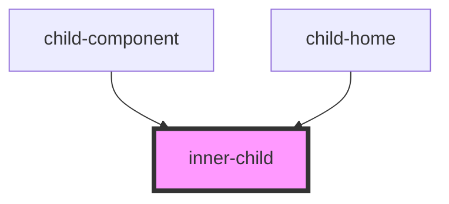

# inner-child

<!-- Auto Generated Below -->

## Properties

| Property | Attribute | Description | Type     | Default     |
| -------- | --------- | ----------- | -------- | ----------- |
| `count`  | `count`   |             | `number` | `undefined` |

## Events

| Event           | Description | Type                |
| --------------- | ----------- | ------------------- |
| `IncreaseCount` |             | `CustomEvent<void>` |

## Dependencies

### Used by

 - [child-component](../child-component)
 - [child-home](../child-home)

### Graph

----------------------------------------------

*Built with [StencilJS](https://stenciljs.com/)*
